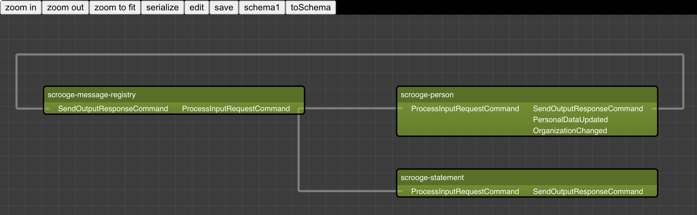

# Versta

Versta collects AsyncAPI description from microservices and shows a map of interaction between them.

For example we have 3 services (scrooge-message-registry, scrooge-person, scrooge-statement). Each service has an /async-api http endpoint, that returns a JSON in [AsyncAPI](https://www.asyncapi.com/) format, that discribes which queue that service is consuming or in which he is producing messages and the types of those messages. So if we collect all that information, than we could show the links between those services. 

For each service, the message types that are consumed are shown on the left side, and the message types that are produced are shown on the right side.

This project was created only to improve Haskell and TypeScript skills.
